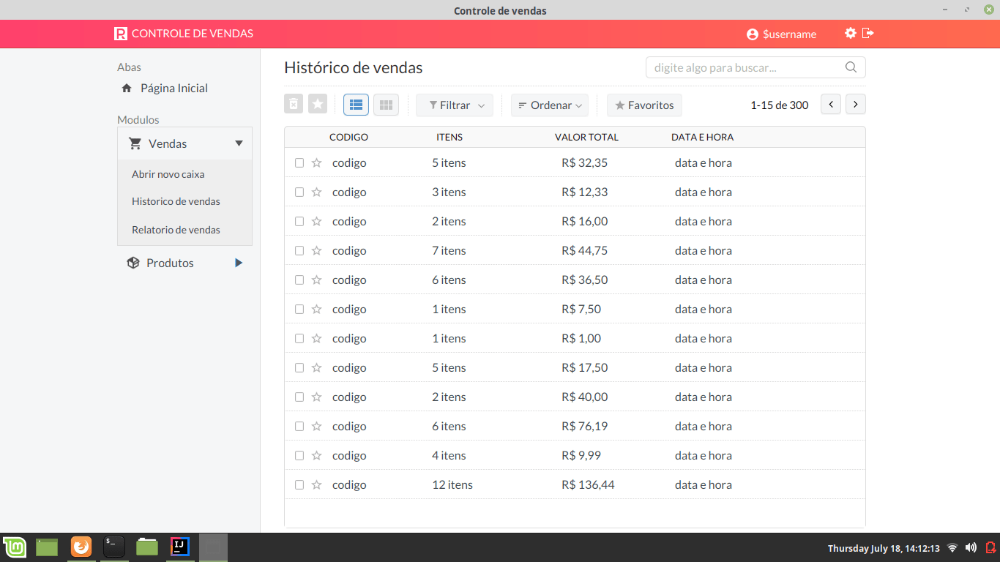
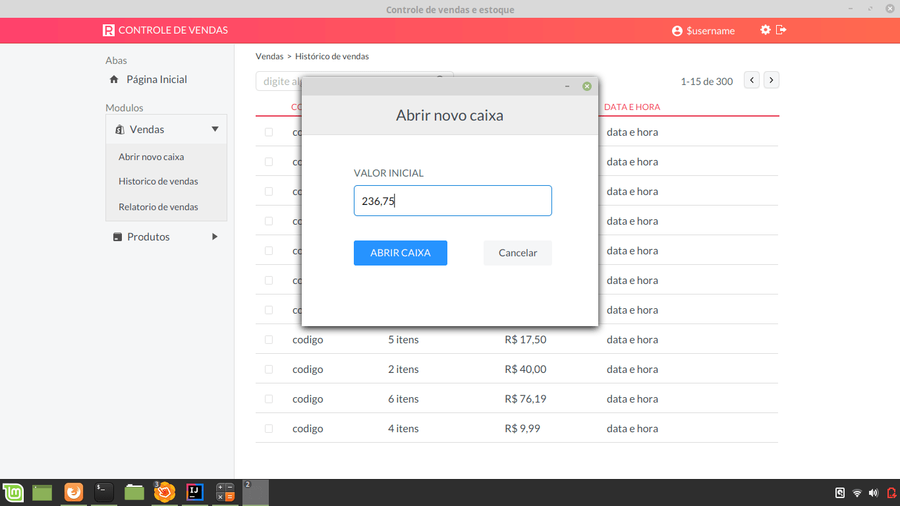
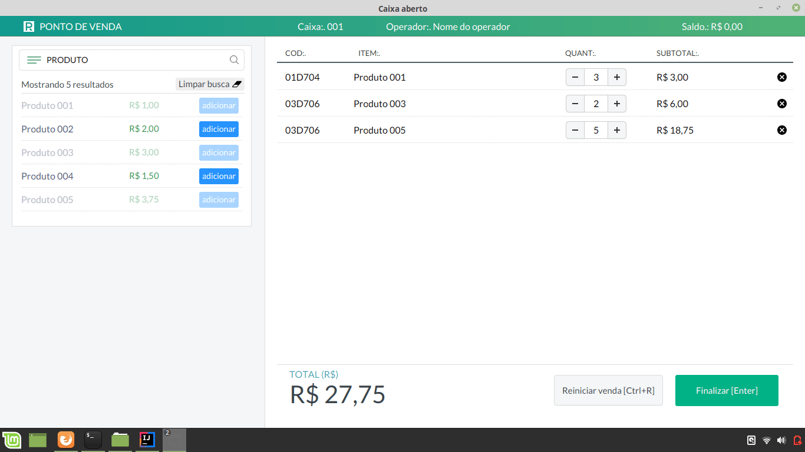
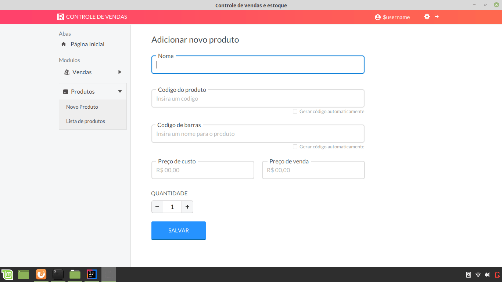

## Sistema de Controle de vendas e Estoque em JavaFX [Em desenvolvimento]
Projeto simples para fins de estudos, ainda em desenvolvimento, por enquanto focado nas regras de negócio e visualização. Em breve será adicionado a camada de persistência.

#### Algumas funcionalidades
* Abrir/fechar caixa
* Ponto de venda
* Cadastro de produtos
* Histórico de vendas
* Lista de produtos em estoque
* (em breve) Relatório de vendas
* (em breve) Relatório de estoque

#### Algumas imagens

Histórico de vendas

Abertura novo caixa

Ponto de venda

Adicionar novo produto

